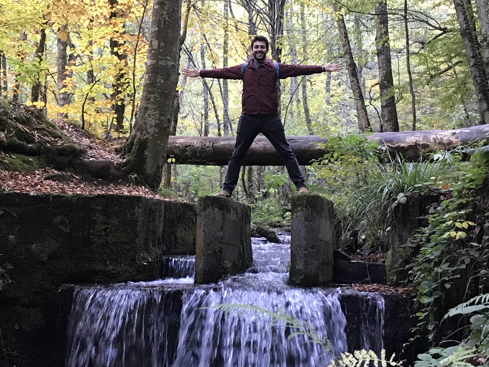

#### Merhaba ben Gökhan,  Mesleğine aşık bir yazılım mühendisiyim.

 #Blogger #Kotlin #Java #Microservice-architecture 

Windows 95'le başlayan bilgisayar serüvenim lisede yazılımla tanışmamla devam etti, sonrasında bende sevdiği işi yapanlardan oldum. 
Lise yıllarımdan beri yazılımla ilgileniyorum, şimdilerde ağırlıklı olarak Microservice Mimarisi ile Kotlin, Java gibi dilleri kullanarak yazılım geliştiriyorum. 
Bunların yanı sıra öğrendiklerimi biraz olsun aktarabilmek için medium üzerinden yazılar yazıyorum.

Netaş, Turkcell, Teknasyon gibi şirketlerde çalıştıktan sonra Yemeksepeti'nde kariyerime devam ediyorum.

> [ 
 Tecrübelerimi aktarmak, teknik konuları konuşmak, problemleri çözmek ya da geleceğin için sana yardımcı olmak için tanışabiliriz. 1:1 Superpeer ⟶
](https://superpeer.com/gokhana) 

* Yazılarımı okumak için | <FontAwesomeIcon icon={['fab', 'medium']} /> [Medium](https://gokhana.medium.com/)

* Teknik ve iş için | <FontAwesomeIcon icon={['fab', 'linkedin']} /> [Linkedin](https://www.linkedin.com/in/gokhan-a/)

* Biraz iş biraz goygoy için | <FontAwesomeIcon icon={['fab', 'twitter']} /> [Twitter](https://twitter.com/g_khana)

* Kodlar için | <FontAwesomeIcon icon={['fab', 'github']} /> [Github](https://github.com/G-khan)

