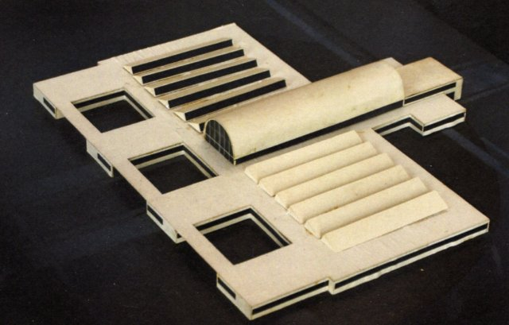
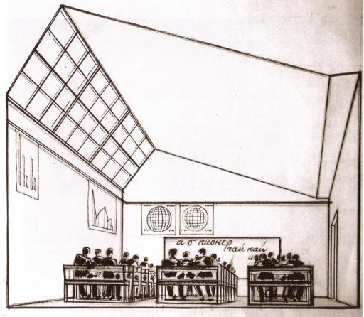
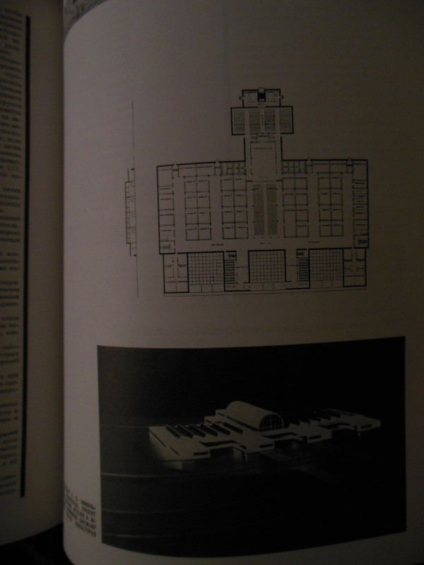

Сейчас читаю репринт журнала Современная Архитектура, выходившего в период с 1927 по 1930. Интересное чтение, одно дело читать аналитические работы о том времени, и совсем другое сам материал, именно то что писали и чем делились архитекторы-конструктивисты.

Журнал полон оптимизма и веры в будущее, но читать это скорее грустно ибо мы знаем чем все в итоге закончиться для конструктивистов.

Но я хочу рассказать не об этом. В выпуске СА 4, 1928 года, есть проект школы. Вот он:

Главная фишка заключается в том что классы расположены в глубине здания, а не вдоль внешних стен, как у любой школы (как у школ того времени, так и у современных типовых школ). Как же классы в такой школе освещаются солнечным светом, окон же выходит по бокам нет? Но они есть, только не с боку, а с верху.

Эскиз того как это должно было выглядеть внутри класса:

Помимо прочих плюсов такой конструкции типа равномерного освещения, при такой планировки ученики не будут отвлекаться на вид из окна (это приводиться в качестве плюса в самом журнале).

Кстати из этого эскиза не понятно каким образом летом ученики будут защищены от солнечного света, занавесок-то нет. Хотя в современных реалиях можно было бы поставить специальные жалюзи или да же специальное «умное» стекло умеющее затемняться или становиться прозрачным в зависимости от небольшой подачи электричества.

Вот планировка школы, её я так и не нашел в интернете, по этому сделал снимок из самого журнала:

Классы расположены прямо внутри здания и не находятся вдоль внешних стен.

Конечно было бы интересно попасть в такую школу, хотя в современных реалиях такая идея могла бы быть реализована, например при постройке кампуса или загородного офисного комплекса. В плотно застроенном городе такая идея сложно реализуема ибо такое здание должно быть одноэтажным.
