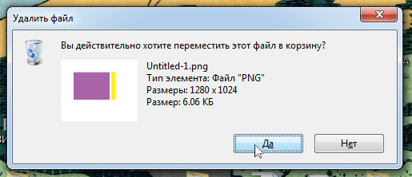

Я тут недавно купил мышку Майкрасофта: Explorer Touch Mouse, мышка хорошая и очень интересная, но сказать я хотел не о ней. Дело в том что ПО для этой мышки включило очень странную, и да же абсурдную функцию. К примеру когда вы удаляете какой-то файл, то перед этим появляется окно с вопросом «хотите ли вы удалить этот файл?» и двумя вариантами ответа, да или нет. Ну вот оно:

Так вот, теперь компьютер сам, автоматически наводит курсор на кнопку «да», а мне нужно только щелкнуть, и так происходит практически во всех ситуациях с подобным диалоговым окном. Казалось бы, хорошая идея, ведь в подавляющем числе случаев я всегда буду нажимать «да». Только вот подобное решение делает бессмысленным само появление этого диалогового окна ведь оно появляется только для того что бы я мог предотвратить свою возможную ошибку, но как я могу её предотвратить если компьютер буквально хватает меня за руку и тянет к правильному, с его точки зрения, ответу?

Интерфейс буквально преодолевает сам себя, «помогая» пользователю преодолеть препятствия которые он (интерфейс) сам и расставил. При чем да же не спрашивая меня, как будь-то пользователь является некой досадной помехой для компьютера.
